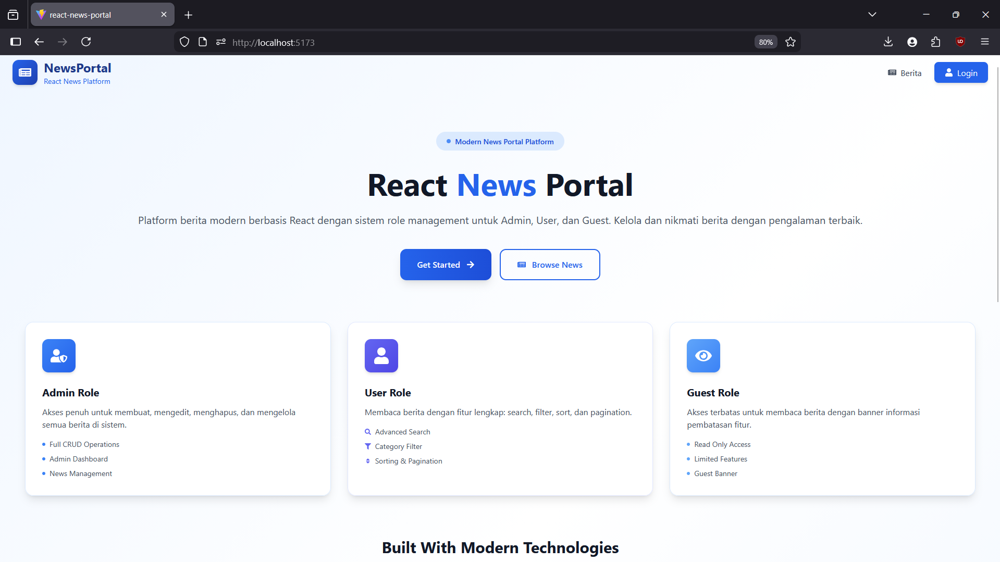
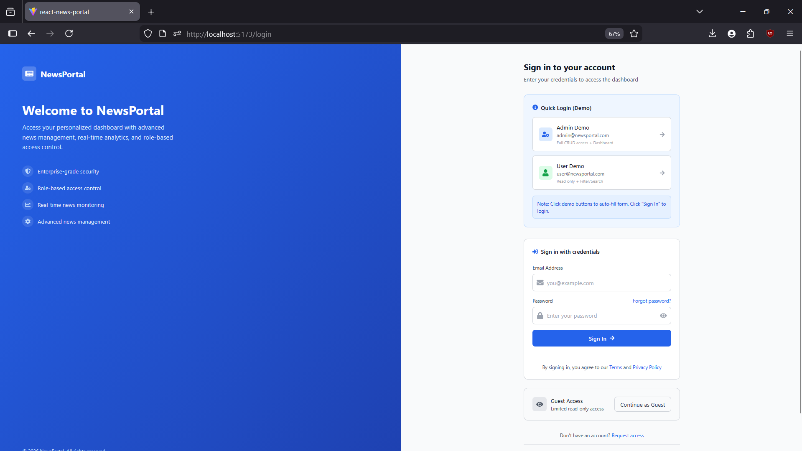
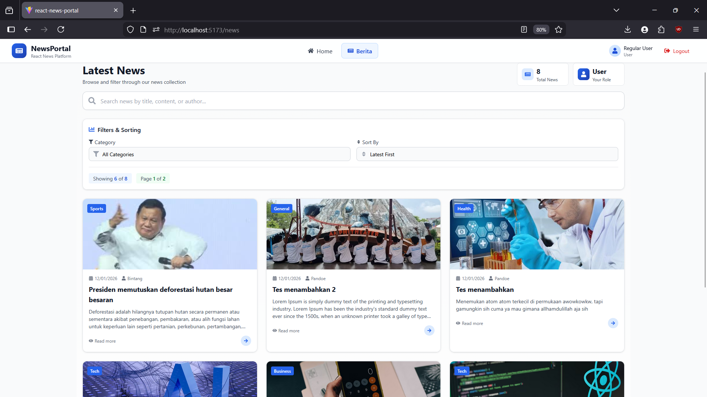
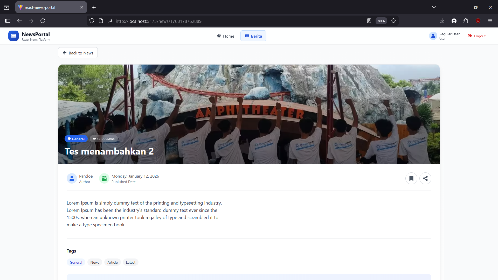
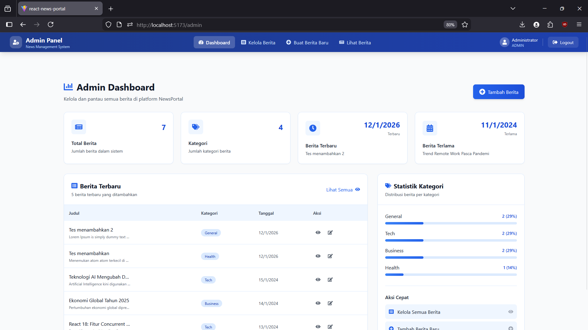
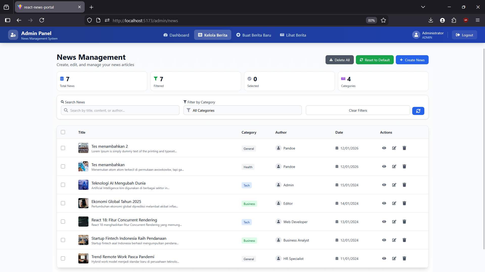
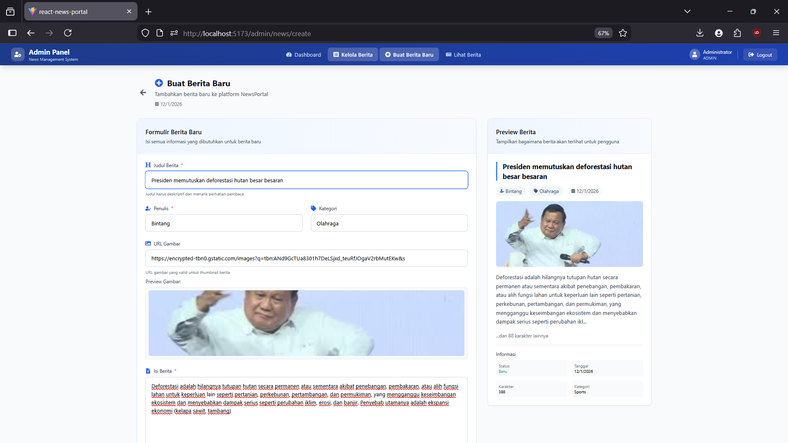
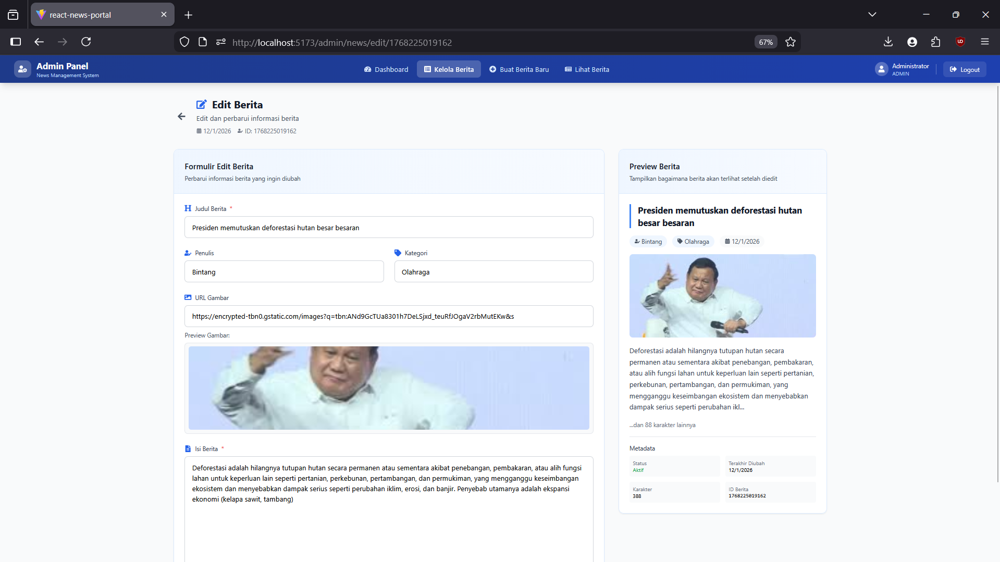

# 📰 React News Portal

React News Portal adalah **project frontend skala besar** yang dibuat untuk kebutuhan **submission magang / portfolio**, dengan simulasi portal berita modern yang memiliki **role Admin, User, dan Guest**.

Project ini **fokus pada logic & flow frontend**, bukan sekadar UI, dengan penekanan pada:
- Fetch & CRUD data
- Role-based access
- Protected routes
- Search, filter, sort, dan pagination
- Clean architecture & folder structure

---

## 📸 Screenshots

> Semua screenshot disimpan di folder `/screenshots`

### 🔹 Welcome Page


### 🔹 Login Page


### 🔹 News Listing (User / Guest)


### 🔹 News Detail


### 🔹 Admin Dashboard


### 🔹 Admin Manage News


### 🔹 Create News


### 🔹 Edit News


---

## 🔗 Live Documentation
📘 **Dokumentasi Project (Google Docs)**  
👉 https://docs.google.com/document/d/16a18MqPaY4nLZFGogYr3cjOjmQ05l6cFb0PJ3RRQ3hc/edit?usp=sharing

---

## 🚀 Tech Stack

- **React 18**
- **Vite**
- **React Router DOM v6**
- **Tailwind CSS v3**
- **LocalStorage (Mock API)**
- **PNPM**

---

## 👥 User Roles

### 🔑 Admin
- CRUD berita
- Admin Dashboard
- Statistik berita
- Manajemen konten penuh

### 👤 User
- Read berita
- Search, filter, sort
- Pagination
- Detail berita

### 👀 Guest
- Read-only
- Guest banner pembatasan fitur
- Prompt login

---

## 📁 Folder Structure

```
src/
├── components/
├── pages/
├── layouts/
├── context/
├── hooks/
├── services/
├── utils/
├── App.jsx
└── main.jsx
```

---

## ⚙️ Installation

```bash
git clone https://github.com/Fhrx/react-news-portal.git
cd react-news-portal
pnpm install
pnpm dev
```

---

## 🧪 Dummy Accounts

| Role | Username | Password |
|----|----|----|
| Admin | admin | admin123 |
| User | user | user123 |

---

## 🎯 Project Goals
- CRUD API
- Search / Filter / Pagination
- Role-based routing
- Real-world frontend simulation

---

## ✨ Author
**Fhrx**  
Frontend Developer  
Portfolio Project – Internship Submission
